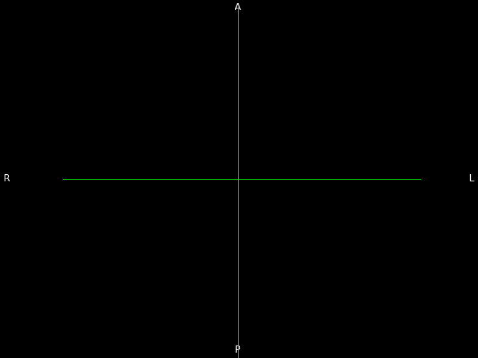

# Latent Event Mapping (LEMING)

LEMING is an interpretable disease progression modelling framework that leverages 
variational permutation inference to enable rapid, low-compute inference of
distributions of fine-grained multi-modal trajectories.

If you use LEMING, please cite the following papers.

Application to Alzheimer's disease:

S Pinnawala, A Hartanto, M Jairamani, IJA Simpson, PA Wijeratne (2026). Revealing trajectories of multi-modal voxel-level changes in neurodegenerative diseases using latent event mapping. bioRxiv 2026.06.07.730710; doi: \url{https://doi.org/10.64898/2026.06.07.730710 }

Modelling methodology:

PA Wijeratne & DC Alexander (2024). "Unscrambling disease progression 
at scale: fast inference of event permutations with optimal transport". 
Advances in Neural Information Processing Systems. 
\url{https://doi.org/10.48550/arXiv.2410.14388}

## Installation

Install directly from GitHub using pip:

```bash
pip install git+https://github.com/lililab-sussex/leming
```

### Dependencies

| Package      | Version     |
|--------------|-------------|
| numpy        | >=1.26, <2  |
| scipy        | >=1.11      |
| scikit-learn | >=1.3       |
| torch        | >=2.2       |
| matplotlib   | >=3.7       |

Python 3.10 or higher is required.

## Example

Here we apply the vEBM to structural MRI data from the Alzheimer's 
Disease Neuroimaging Initiative (ADNI) dataset. It shows pixel-level 
disease progression events in the brain, providing new fine-grained 
insights into changes at the tissue-level caused by Alzheimer's disease.
	 
Training this model took only 5 minutes on a single laptop CPU.



## Contributors
- Peter Wijeratne (p.wijeratne@sussex.ac.uk)
- Misha Jairamani

## License: MIT
