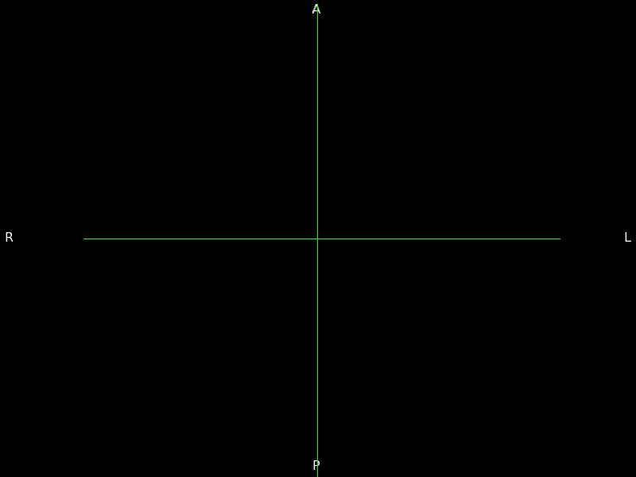

# Latent Event Mapping (LEMING)

LEMING is an interpretable generative disease progression modelling framework that leverages optimal transport to enable rapid, low-compute inference of distributions of fine-grained multi-modal trajectories.

If you use LEMING, please cite the following papers.

Multi-modal application of framework in Alzheimer's:

S Pinnawala, A Hartanto, M Jairamani, IJA Simpson, PA Wijeratne (2026). "Revealing trajectories of multi-modal voxel-level changes in neurodegenerative diseases using latent event mapping". bioRxiv. DOI: https://doi.org/10.64898/2026.06.07.730710

Model methodology:

PA Wijeratne & DC Alexander (2024). "Unscrambling disease progression at scale: fast inference of event permutations with optimal transport". 
Advances in Neural Information Processing Systems 38. DOI: https://doi.org/10.48550/arXiv.2410.14388

## Installation

Install directly from GitHub using pip:

```bash
pip install git+https://github.com/lililab-sussex/leming
```

### Dependencies

Python 3.8 or higher is required.

| Package      | Version     |
|--------------|-------------|
| numpy        | ==1.24      |
| scipy        | ==1.9       |
| scikit-learn | ==1.3       |
| torch        | ==2.2       |
| matplotlib   | ==3.7       |

## Example

Run the example script on simulated data:

```bash
python run_sim.py
```

### Application in neurodegenerative disease

Here we obtain a LEMING using structural MRI data from the Alzheimer's 
Disease Neuroimaging Initiative (ADNI) dataset. It shows pixel-level 
disease progression events in the brain, providing new fine-grained 
insights into changes at the tissue-level caused by Alzheimer's disease.
	 
Training this model took only a couple of minutes on a single laptop CPU.



## Contributors
- Peter Wijeratne (p.wijeratne@sussex.ac.uk)
- Misha Jairamani

## License: MIT
